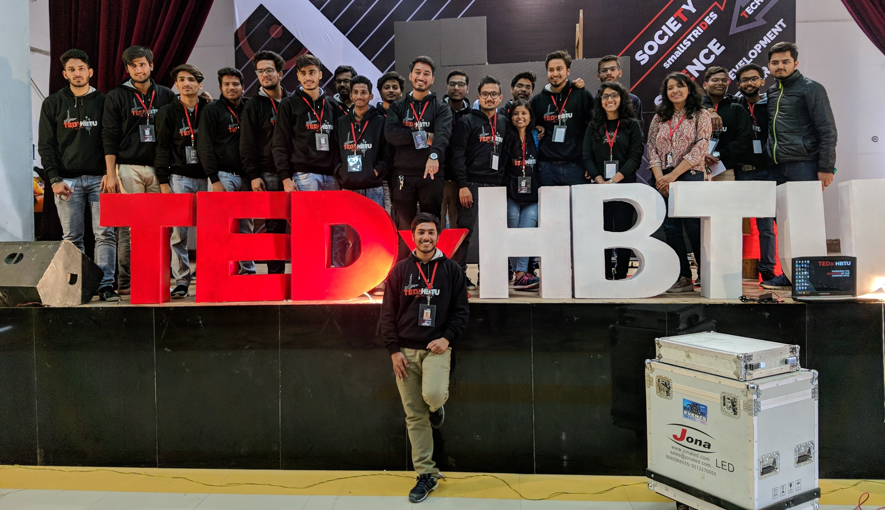

## 

## A little about me... 

I have done my graduation from [HBTI Kanpur](https://hbtu.ac.in/) in **Biochemical Engineering** and my **Post graduation🎓** from [IIIT Allahabad](https://www.iiita.ac.in/) in **Information Technology (spl. in Bioinformatics)**. I'm a **Tech Enthusiast💻** passionate about learning and working with new tech, frameworks and libraries. 

### 📫 Want to talk? 
<em><b>I love connecting with different people.</b> 

Pick a slot if you'd like to chat about anything you are passionate about or want to collaborate.

## Experience

I've collaborated in the development of an open source novel full-stack language/library framework **FTD** in an Indian-based tech startup [FifthTry](https://www.fifthtry.com/) as a **Software/backend Developer Intern** 💼, where i employed Rust, Django, and **FTD** as the tech stack for development.   

There I played a role in the configuration of Continuous Integration/Continuous Deployment (CI/CD) for the FTD starter template and facilitated Debian installation on Linux-based systems along with developing package manager (FPM, now FASTN) functionality by incorporating additional tests for its commands.

<!--   -->

## Technologies I've Learned/Worked with:
- Rust
- React
- Node
- Django
- C++
- Firebase

 
<a href="https://reactjs.org/" target="_blank"><code> </code></a>
<a href="https://cplusplus.com/" target="_blank" ><code><</code></a>
<a href="https://html.com/" target="_blank"><code></code></a>
<a href="https://nodejs.org/" target="_blank"><code> </code></a>
<a href="https://www.djangoproject.com/" target="_blank"><code> </code></a>
<a href="https://developer.mozilla.org/en-US/docs/Web/JavaScript" target="_blank"><code> </code></a>
<!-- <a href="https://www.typescriptlang.org/" target="_blank"><code> </code></a> -->
<!-- <a href="https://nextjs.org/" target="_blank"><code> </code></a> -->
<!-- <a href="https://tailwindcss.com/" target="_blank"><code> </code></a> -->
<a href="https://getbootstrap.com" target="_blank"><code> </code></a></code></a> <a href="https://www.docker.com/" target="_blank"><code> </code></a>
<a href="https://git-scm.com/" target="_blank"><code> </code></a>
<!-- <a href="https://jestjs.io" target="_blank"><code> </code></a> -->
<!-- <a href="https://www.mongodb.com/" target="_blank"><code> </code></a> -->
<a href="https://www.mysql.com/" target="_blank"><code> </code></a>
<!-- <a href="https://www.postgresql.org" target="_blank"><code> </code></a> -->

## 🖥️ Setup i have worked with:

## 🎊 Few of my projects:

- [Connect-4](https://aviralrabbit1.github.io/connect-4/) : A game where you have to join 4 dots either horizontally, vertically or diagonally.
  
- [3js-world](https://aviral-3js-portfolio.web.app/) : A trial of three.js framework by me.
  
- [AMDB](https://amdb-zeta.vercel.app/) : A clone of IMDB movie app.
  
- [Chatroom](https://aviralchatrooms.netlify.app/) : A simple chat app based on [chatengine.io](chatengine.io)
  

## 📫 Find me at -

 

<!--  -->

 

### 📊 Quick Stats :

|  |  |
| ------------- | ------------- |

<!--  -->

</img>

    
||
| -------------|

<!--  -->

<!--  -->

Miscellaneous :

- **Working**: 🔭 I’m currently working on ... a sci-fi themed nasa project(educational).
- **Learning**: 🌱 I’m currently learning Node, MongoDB, CI/CD, Redux-toolkit.
- **Collaboration** :👯 I’m looking to collaborate on any new interesting project.
- **Hobbies** : I like music 🎹, poetry 📝✍ , anime and gaming 🎮.

<!--  -->

<!--START_SECTION:waka-->
<!--END_SECTION:waka-->

<!-- 

 -->
